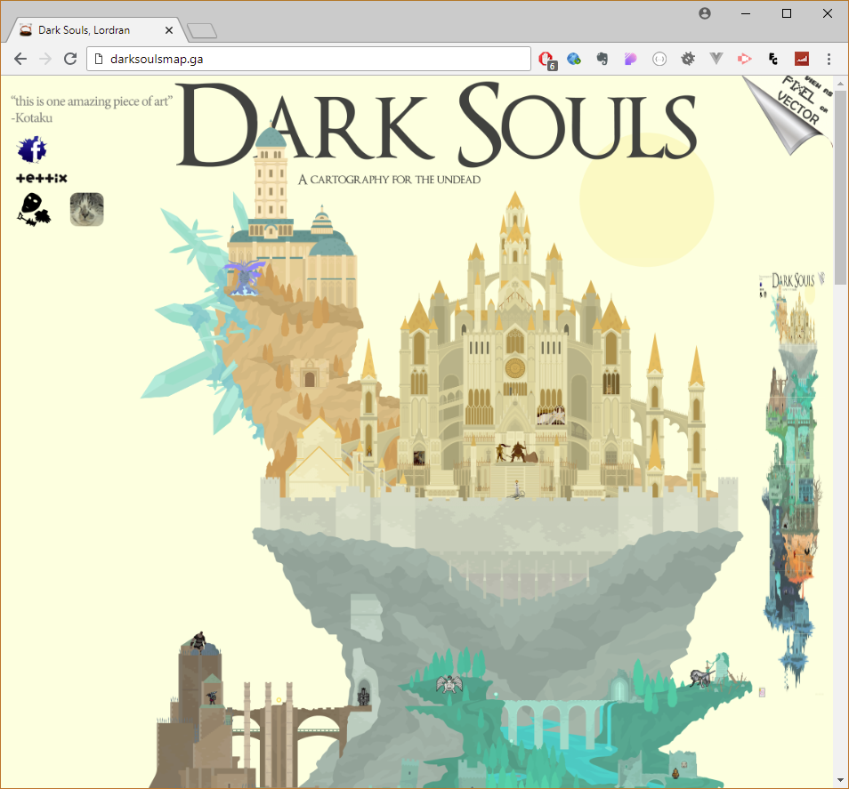

# Dark Souls Interactive Map - http://darksoulsmap.ga/
- A tribute to three designers, an eye-catching vector-based background of Lordran viewed by 40 thousands people on Kotaku, as well as two figure models (vector and bitmap)

A Success Story ( https://twitter.com/tettix/status/843910740796956672 ) made on behalf of tettix, the founder of Lordran Map, (which took 3 months to complete) to make a visual representation of his worldview combined with enemies and characters created by digitalcleo and servantofentropy. Click any characters provides more in-depth details about their origin and Dark Souls Lore. Website can be viewed in Vector or Pixel mode (top-right corner), 'clicking' on the Sun changed between Day-night cycle. Some extra easter eggs. A chat message box was implemented but removed due to request by client. 

## Techniques used
Colorbox.js, Jquery, Minimap.js, ios.orientationchange.fix, rwdImageMaps.js. And a big ladle to mix it all togather! :)

## Designers and Media Coverage

Kotaku article: https://kotaku.com/lordran-the-setting-of-dark-souls-almost-entirely-red-1682735168

Link to Designers:
http://servantofentropy.deviantart.com/art/Dark-Souls-Characters-504261284
http://digitalcleo.deviantart.com/art/All-Dark-Souls-bosses-566974729
http://tettix.net/lordran/lordran.html

